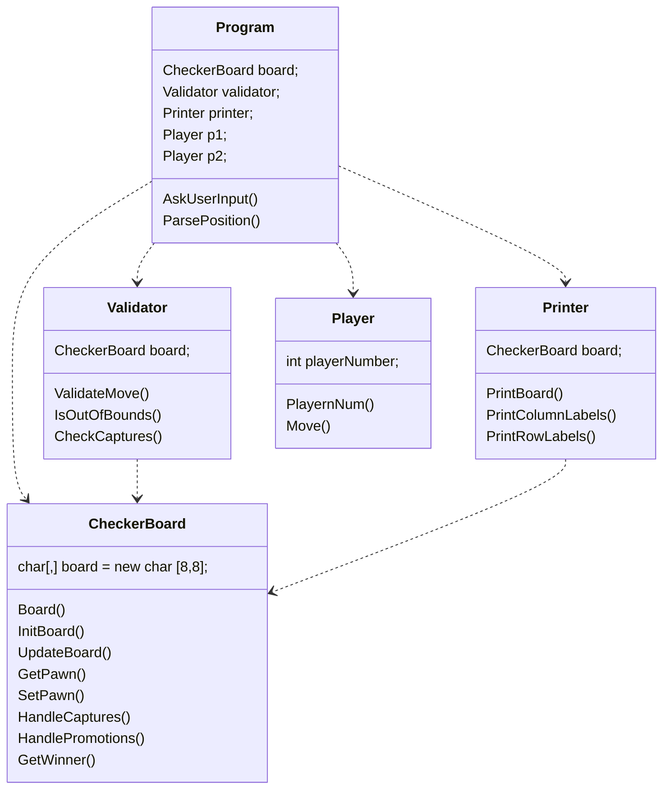

```mermaid

classDiagram
    Program ..> CheckerBoard
    Program ..> Validator
    Validator ..> CheckerBoard
    Printer ..> CheckerBoard
    Program ..> Printer
    Program ..> Player

    class Program {
        CheckerBoard board;
        Validator validator;

        Printer printer;
        Player p1;
        Player p2;
        AskUserInput()
        ParsePosition()
    }
    class CheckerBoard {
      char[,] board = new char [8,8];
      Board()
      InitBoard()
      UpdateBoard()
        GetPawn()
        SetPawn()
        HandleCaptures()
        HandlePromotions()
        GetWinner()
    }
    class Printer {
        CheckerBoard board;
        PrintBoard()
        PrintColumnLabels()
        PrintRowLabels()
    }
    class Validator {
        CheckerBoard board;
        ValidateMove()
        IsOutOfBounds()
        CheckCaptures()
    }
    class Player {
      int playerNumber;
      PlayernNum()
      Move()
    }
```
