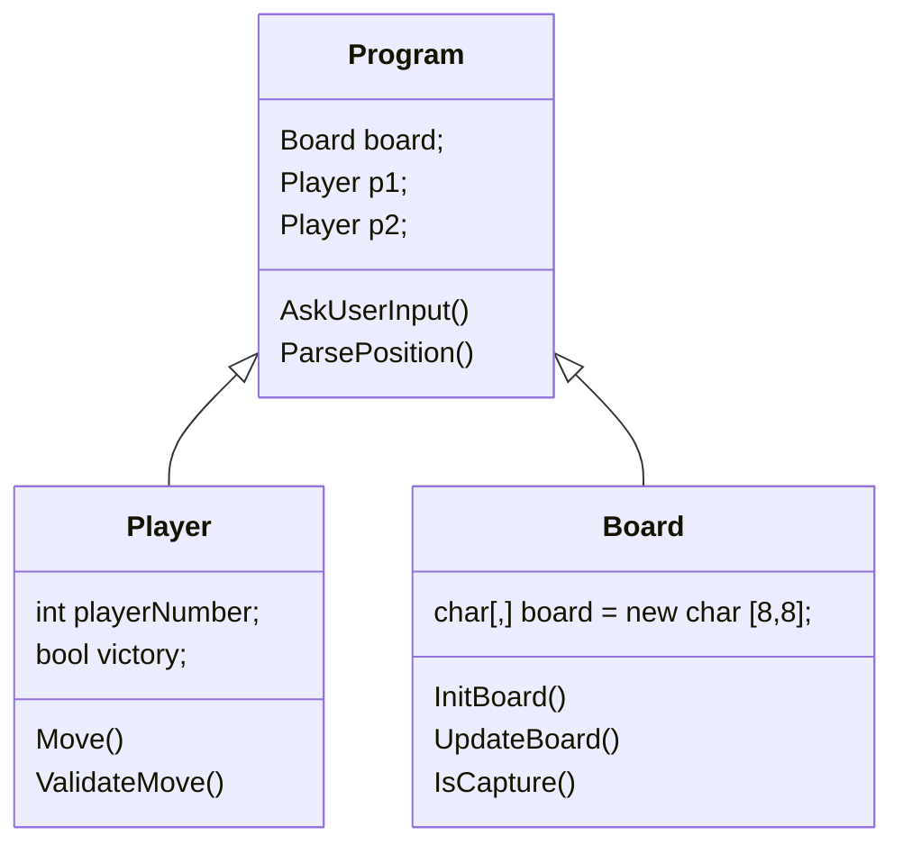

```mermaid
classDiagram
    Program <|-- Player
    Program <|-- Board
    class Program {
        Board board;
        Player p1;
        Player p2;
        AskUserInput()
        ParsePosition()
    }
    class Player {
      int playerNumber;
      bool victory;
      Move()
      ValidateMove()
    }
    class Board {
      char[,] board = new char [8,8];
      InitBoard()
      UpdateBoard()
      IsCapture()
    }
```
