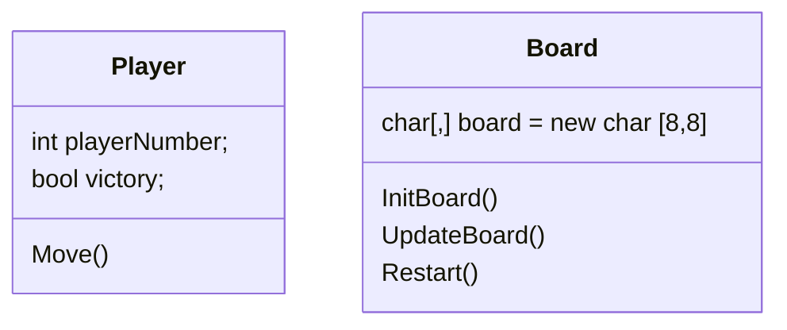

```mermaid
classDiagram
    class Player{
      int playerNumber;
      bool victory;
      Move()
    }
    class Board{
      char[,] board = new char [8,8]
      InitBoard()
      UpdateBoard()
      Restart()
    }
```
