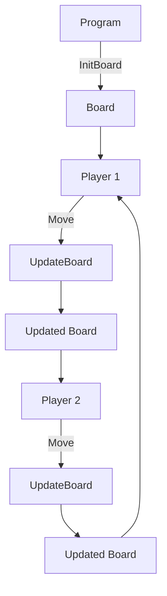

```mermaid
flowchart TD
    A[Program] --> |InitBoard| B[Board]
    B --> C[Player 1]
    C --> |Move| D[UpdateBoard]
    D --> E[Updated Board]
    E --> F[Player 2]
    F --> |Move| G[UpdateBoard]
    G --> H[Updated Board]
    H --> C
```
